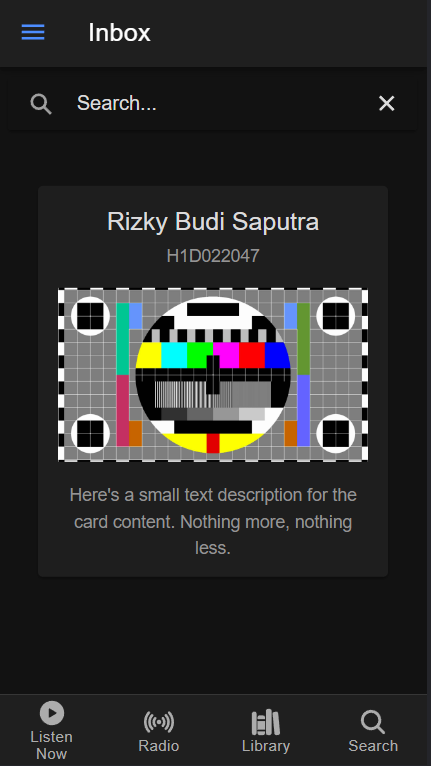

# Tugas 6 Praktikum Pemrograman Mobile
Nama    : Rizky Budi Saputra
NIM     : H1D022047
Shift Lama D, Shift Baru F



Untuk menambah component itu cukup pilih dan copy kode dari https://ionicframework.com/docs/components 

Pertama ada search bar
```html
<ion-searchbar value="Search..."></ion-searchbar>
```

Kemudian card
```html
<ion-card>
    <ion-card-header>
        <ion-card-title>Rizky Budi Saputra</ion-card-title>
        <ion-card-subtitle>H1D022047</ion-card-subtitle>
        <br>
        
    </ion-card-header>

    <ion-card-content>
        Here's a small text description for the card content. Nothing more, nothing less.
    </ion-card-content>
</ion-card>
```

Dan terakhir adalah tabs
```html
<ion-tabs>
    <ion-tab-bar slot="bottom">
        <ion-tab-button tab="home">
        <ion-icon name="play-circle"></ion-icon>
        Listen Now
        </ion-tab-button>
        <ion-tab-button tab="radio">
        <ion-icon name="radio"></ion-icon>
        Radio
        </ion-tab-button>
        <ion-tab-button tab="library">
        <ion-icon name="library"></ion-icon>
        Library
        </ion-tab-button>
        <ion-tab-button tab="search">
        <ion-icon name="search"></ion-icon>
        Search
        </ion-tab-button>
    </ion-tab-bar>
</ion-tabs>
```